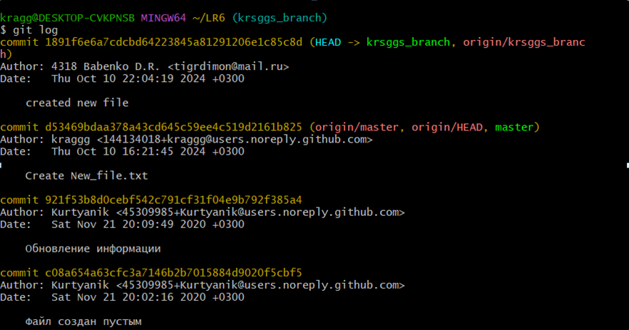

# Лабораторная работа №6
## Система контроля версий

## Цель лабораторной работы
Изучение базовых возможностей системы управления версиями, опыт работы с Git Api, опыт работы с локальным и удаленным репозиторием. 

## Ход работы
Делаем форк репозитория с помощью интерфейса GitHub.

Клонируем репозиторий в личное хранилище с помощью git clone https://github.com/Kurtyanik/LR6. 

Создаем файл с помощью интерфейса GitHub и добавляем его в локальный репозиторий с помощью git fetch.

Далее создаем свою ветку с помощью git branch krsggs_branch и пушим ее.

Далее получаем историю коммитов с обеих веток.

Теперь делаем merge веток.

Далее удаляем ветку с помощью git push origin --delete krsggs_branch удаленно и с помощью git branch -D krsggs_branch локально.

Далее создаем ветку report, где редактируем файл README.md и своевременно коммитим коммиты.

## Хронология

2b80fa1 - 2024-10-11 00:41:13 +0300 - 4318 Babenko D.R. - обновил папку images

b7c28b6 - 2024-10-11 00:38:38 +0300 - 4318 Babenko D.R. - Продолжил делать отчет

dd3993d - 2024-10-11 00:28:37 +0300 - 4318 Babenko D.R. - папка images

6c07adf - 2024-10-11 00:25:51 +0300 - 4318 Babenko D.R. - Начал писать отчет

ae873e9 - 2024-10-10 23:26:11 +0300 - 4318 Babenko D.R. - Revert "коммит, который нужно откатить

1bd7d09 - 2024-10-10 23:24:11 +0300 - 4318 Babenko D.R. - коммит, который нужно откатить

d53469b - 2024-10-10 16:21:45 +0300 - kraggg - Create New_file.txt

921f53b - 2020-11-21 20:09:49 +0300 - Kurtyanik - Обновление информации

c08a654 - 2020-11-21 20:02:16 +0300 - Kurtyanik - Файл создан пустым

3c6e913 - 2020-11-21 19:58:20 +0300 - Kurtyanik - Initial commit

